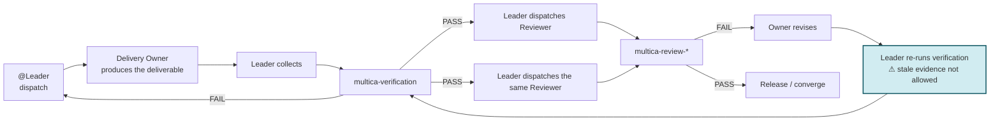
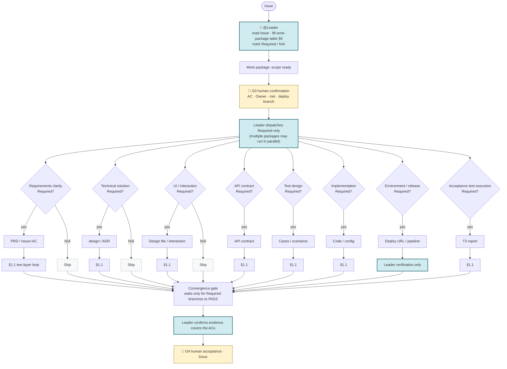
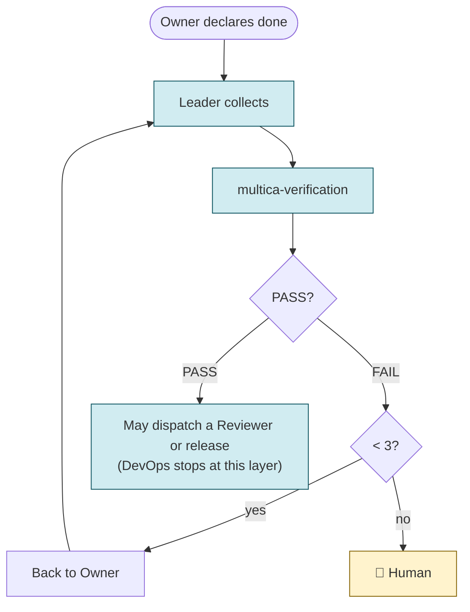
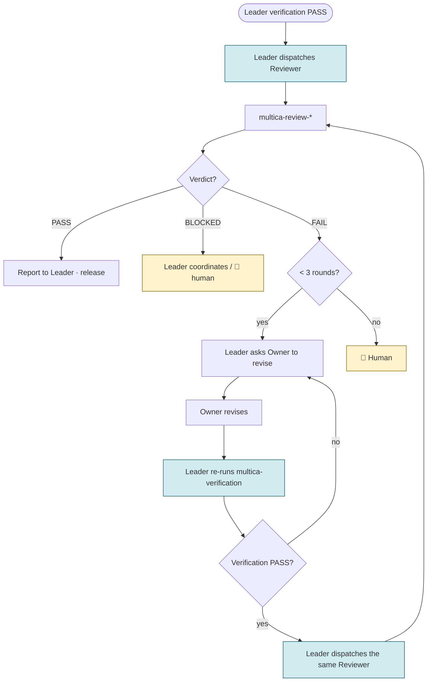
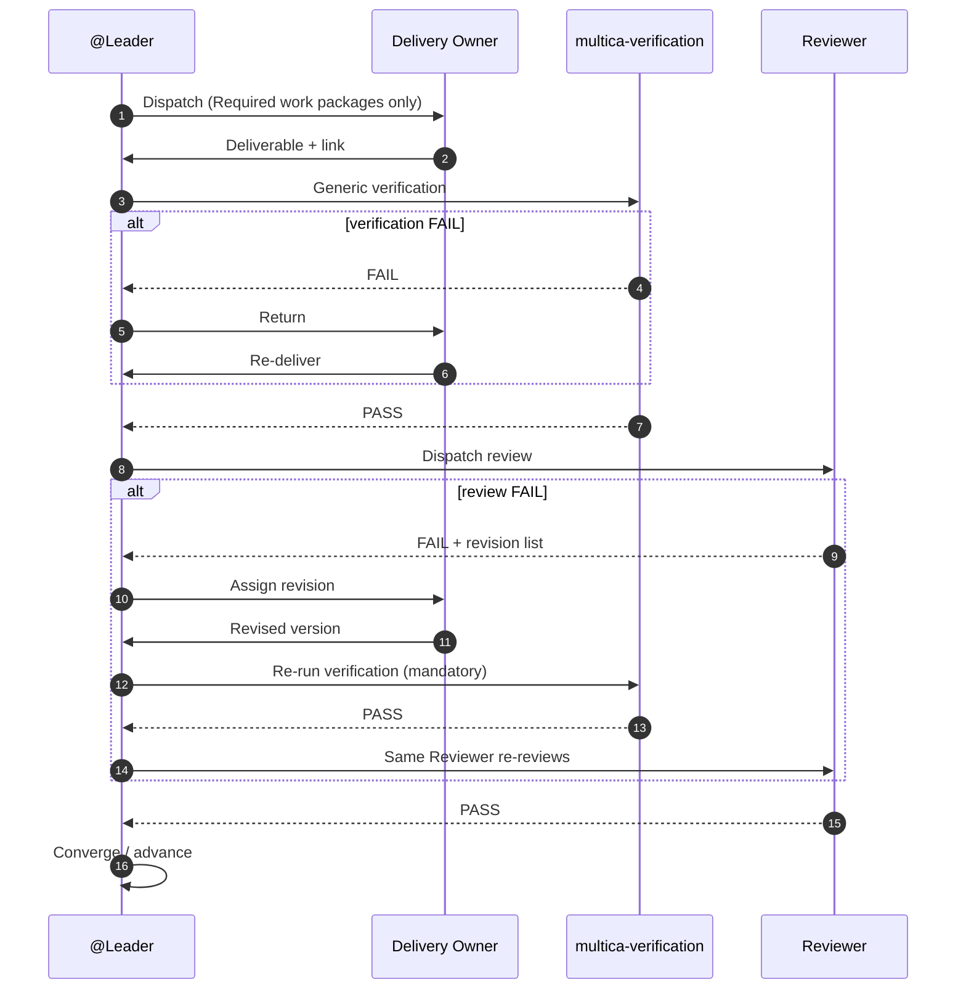
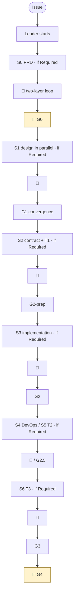

# Software Development (Reviewed) — full flow

> **Demo-facing** — the body explains **deliverable-driven tailoring** and **Leader orchestration**; the S0–S6 / skill details of [`software-development-reviewed`](../../templates/en_US/squad/software-development-reviewed/squad.md) live in **Appendix A**.
> Companions: [`gates-and-evidence.md`](gates-and-evidence.md) · [`cicd-and-test-pipeline.md`](cicd-and-test-pipeline.md) · [`artifact-conventions.md`](artifact-conventions.md)

---

## 0. Two layers to separate before you read

| Layer | What it answers | Where |
| --- | --- | --- |
| **Method layer** | Deliverables and risk decide the **work packages**; governance rules decide review and human gates | §1–§8 |
| **Reviewed Starter config layer** | Every enabled **standard deliverable** defaults to two layers (generic verification + dedicated Reviewer); DevOps is the **exception** (Leader verification only); G0 / G4 are **human**; failures escalate after **3** | §0.1, §4, Appendix A |

**The point of this document:** correct the misconception that "every producing role must appear in sequence" — **not** to remove the quality gates the Starter already configures.

### 0.1 Reviewed Starter fixed configuration (defaults relative to the method layer)

```text
● Enabled standard deliverable → Leader multica-verification → dedicated multica-review-*
  (DevOps has no Reviewer layer)
● G0 / G4 → human confirmation (agents cannot sign for humans)
● Generic-verification FAIL and professional-review FAIL → counted separately,
  sharing a limit of 3 → escalate to a human
● Trimming roles ≠ trimming gates: not enabling Designer skips the UI work package;
  an enabled UI deliverable still needs DesignReviewer
```

---

## 1. Core model: deliverable-driven, Leader-stitched

**The flow is decided by deliverables, not by the role roster.**

- There is a UI change → a UI / interaction deliverable is needed → dispatch @Designer
- There is an API / data-contract change → contract design is needed → dispatch @BackendDev (contract phase)
- A **new** deployment path or environment is needed → the DevOps work package is needed
- The hard precondition for T3 is **"evidence of a reachable verification environment" (G2.5)**, not "the DevOps role must appear" — if a URL already exists, look at the evidence, not at whether the role is on the roster

**@Leader** (injected by the Squad): read the Issue → **fill in the work-package table (§6)** → dispatch only **Required** packages → collect → verify → dispatch a Reviewer → converge at the gate → escalate. **Producing roles do not dispatch each other.**

### 1.1 Single-deliverable loop (repeated for every Required work package)



> **Key correction:** after a Reviewer rejects, the deliverable has changed → **generic verification must be re-run** before the same Reviewer reviews again. Pre-revision verification evidence cannot back the new version.

### 1.2 Dynamic main flow (only Required work packages enter)



**Convergence rule:** the gate waits only for **Required** deliverables to pass both layers; an **N/A** branch must never block the flow permanently.

---

## 2. Floor vs optional

| Type | Item | Note |
| --- | --- | --- |
| **Required** | Scope and acceptance criteria | What to do, what not to do, how done is judged |
| **Required** | A clear delivery Owner | Exactly one owner per work package |
| **Required** | Evidence-based verification | "It's done" is not evidence |
| **Required** | A rework or escalation path on failure | Threshold set by the rules (Starter: **3**) |
| **On demand** | PRD, technical design, UI, API contract | Create them only when they reduce uncertainty or satisfy governance |
| **On demand** | PM, Architect, Designer, Tester, DevOps | **Roles carry capability; they are not flow steps** |
| **Per work package** | An independent Reviewer | The method layer looks at risk; the Starter: **enabled standard deliverables default to yes** |
| **Per governance** | Human sign-off | Starter fixes **G0 / G4** |

---

## 3. When a role is enabled

| Role / capability | Enable when | May stay disabled when |
| --- | --- | --- |
| **Leader** | Every Issue in the Reviewed Starter | The Starter config never skips it |
| **ProductManager** | Requirements boundary is unclear, a formal PRD is needed, several parties must align on ACs | The Issue already carries full scope and ACs |
| **Architect** | Cross-system, NFRs, long-lived architecture, hard-to-revert decisions | Local and reversible, follows the existing architecture |
| **Designer** | New screens, key interactions, design-system changes | No UI change |
| **FrontendDev** | Scope includes frontend implementation | No frontend change |
| **BackendDev** | Scope includes server / data / API | No backend change |
| **Tester** | Independent test design, regression, automated execution are needed | Low risk and governance allows producer self-testing + gate verification |
| **DevOps** | CI/CD, environments, release policy must change | The existing deployment path is reusable and this change does not alter release |
| **Reviewer** | The work-package rules require independent review | The work package is disabled or governance wants the generic gate only |

**Three rules:**

1. **Ask which deliverable is missing before asking who does it.**
2. One person may carry several capabilities, but you **cannot fake independence** — the Reviewer must not be the same executing subject as the producer.
3. **A disabled role ≠ missing evidence** — there may be a deploy URL without DevOps; the Leader looks at the precondition evidence.

---

## 4. Two gate layers and sub-loops (Reviewed Starter)

| Layer | Executor | Asks | After FAIL |
| --- | --- | --- | --- |
| **Layer 1** | @Leader · `multica-verification` | Is it correct? Is the evidence complete? Do the ACs line up? | Back to Owner → **re-verify** (≤3) |
| **Layer 2** | Dedicated Reviewer · `multica-review-*` | Is it professional? Is the risk covered? | Owner revises → **re-verify** → **same Reviewer re-reviews** (≤3) |

**BLOCKED ≠ FAIL:** missing upstream, permissions, or environment → BLOCKED, which does **not** consume a quality-rework attempt.

### 4.1 Leader verification sub-loop



### 4.2 Reviewer sub-loop (with re-verification after revision)



### 4.3 Sequence diagram



---

## 5. Gates: wait for "the evidence you need", not for "every role"

| Gate | Exists when | Release condition | Skippable / lightweight |
| --- | --- | --- | --- |
| **G0 scope** | Every task | Scope, ACs, Owner, work-package table are clear | Never skipped; can be very light |
| **G1 solution** | PRD / technical / UI deliverables are needed | **Required** solution evidence passes both layers | Packages with no new solution are marked N/A |
| **G2 implementation** | There is an implementation change | Affected implementation + necessary cases are Ready | Doc-only tasks have no implementation |
| **G2.5 environment** | Post-deployment verification is needed | **Reachable environment + version identifier** | N/A when deployment verification is not needed |
| **G3 acceptance evidence** | Test / runtime evidence is needed | Required evidence types are complete | Skip inapplicable evidence types, never the done judgement |
| **G4 decision** | Business acceptance / release is needed | 👤 someone entitled to decide | The Starter does not let an agent sign by default |

---

## 6. Work-package table (the Leader fills it in when the Issue starts)

Not every Issue runs the full S0–S6; a small task may be just "scope → implementation → verification → delivery".

| Work package | Needed? | Deliverable | Owner (capability/role) | Verification evidence | Independent review (Starter) | Precondition |
| --- | --- | --- | --- | --- | --- | --- |
| Requirements clarity | yes/no/N/A | PRD or complete Issue | PM or Leader converges | AC cross-check | ProductReviewer | — |
| Technical solution | yes/no/N/A | `design.md` / ADR | Architect | Constraints and feasibility | ArchReviewer | Requirements readable |
| UI / interaction | yes/no/N/A | Design file / rules | Designer | States, responsive | DesignReviewer | Requirements readable |
| API contract | yes/no/N/A | OpenAPI + contract md | BackendDev | Contract self-check | BackendReviewer | Requirements / solution |
| Test design | yes/no/N/A | Case JSON / scenarios | Tester | AC coverage | TestReviewer | Scope readable |
| Implementation | yes/no/N/A | Code / config | FE / BE | Build, test, diff | FE/BE Reviewer | Required solution Ready |
| Environment & release | yes/no/N/A | URL / pipeline | DevOps | Deploy log | **Leader verification only** | Implementation deployable |
| Acceptance test execution | yes/no/N/A | T3 report | Tester | AC report | TestReviewer | **G2.5 environment evidence** |

---

## 7. Three typical trims

### 7.1 Lightweight: local, low risk

```text
Issue already has ACs → Owner changes code → self-test + Leader verification
→ (Starter) Reviewer → deliver
```

Do not force PM, Architect, Designer, Tester, and DevOps in "for completeness".

### 7.2 Standard: ordinary product feature

```text
G0 → UI/API solution as needed → implement in parallel → integration verification
→ T3 if there is a URL → G4
```

Enable only the roles that match the actual deliverables.

### 7.3 Strong governance: high risk / controlled release

```text
👤 G0 → formal solution → two review layers → implementation and testing
→ G2.5 evidence → 👤 G4
```

There are more steps because the **risk is higher**, not because the role roster is longer.

---

## 8. Leader checklist

**Before starting**

- [ ] Are scope, exclusions, and ACs clear?
- [ ] Which deliverables are **Required** this time? Which are **N/A**?
- [ ] Is each work package's Owner and precondition clear?
- [ ] What relies on automatic evidence? What needs a Reviewer / a human?

**During execution**

- [ ] Dispatch **Required** work packages only; do not invent empty tasks for absent roles
- [ ] After a deliverable changes, **re-run the affected verification**
- [ ] Convergence waits for Required branches only
- [ ] Missing information / permission / environment → **BLOCKED**, not disguised as FAIL

**Before wrapping up**

- [ ] Does the evidence cover the ACs that actually apply?
- [ ] Does every N/A have a reason?
- [ ] Have release / security / business decisions been handed to 👤 G4?

---

## 9. The 30-second pitch

1. **Not an everyone-in-a-row assembly line** — fill in the work-package table first; dispatch only what is Required.
2. **The Leader stitches** — dispatch, verify, dispatch Reviewer, converge; producers do not command each other.
3. **After a Reviewer rejects, re-verify first** — then re-review; BLOCKED does not count as a FAIL.
4. **G2.5 looks at environment evidence** — not merely at whether DevOps is on the roster.
5. **The Starter defaults to two gate layers** — an enabled deliverable cannot skip its Reviewer; DevOps is the exception.

---

## Appendix A. Reviewed Starter full reference path (not the default route)

> The "full-house" orchestration for a complete product feature where **every work package is Required**; it maps to the S0–S6 labels in [`squad.md`](../../templates/en_US/squad/software-development-reviewed/squad.md). **Most Issues should trim the §6 table rather than run this appendix by default.**



🔄 = the §4 two-layer sub-loop (including re-verification after revision).

---

## Appendix B. Role · Skill · Reviewer mapping

| Reference phase | Producing role | Skills (in order) | Reviewer | Review skill |
| --- | --- | --- | --- | --- |
| Requirements | @ProductManager | `multica-pm-requirement-spec` → `multica-pm-artifact-publish` | ProductReviewer | `multica-review-product` |
| Technical design | @Architect | `multica-technical-design` → `multica-artifact-architect` | ArchReviewer | `multica-review-architect` |
| UI | @Designer | `multica-design-ui-impl` | DesignReviewer | `multica-review-designer` |
| API contract | @BackendDev | `multica-artifact-backend` | BackendReviewer | `multica-review-backend` |
| T1 cases | @Tester | `multica-test-orchestration` → `multica-test-t1-design` | TestReviewer | `multica-review-test` |
| Frontend implementation | @FrontendDev | `multica-frontend-impl` → `multica-artifact-frontend` | FrontendReviewer | `multica-review-frontend` |
| Backend implementation | @BackendDev | `multica-backend-impl` → `multica-artifact-backend` | BackendReviewer | `multica-review-backend` |
| DevOps | @DevOps | `multica-platform-jenkins` → `multica-artifact-cicd-sync` | **none** | — |
| T2 | @Tester | `multica-test-t2-coverage` | TestReviewer | `multica-review-test` |
| T3 | @Tester | `multica-test-t3-ui-automation` + `multica-test-t3-api-automation` | TestReviewer | `multica-review-test` |

Product review FAIL → Workflow B updates in place (do not create a duplicate story), following the same §4.2 "revise → re-verify → re-review" cycle.

---

## Appendix C. Branches · artifacts · commands

**Deploy branch (G0):** `release/<ISSUE-KEY>-<slug>`; feature branches merge before G2; DevOps builds the deploy branch only.

**Convergence (full-house reference):** G2-prep = contract + T1; G2 = implementation; G3 = T2 + T3 (T3 needs G2.5 environment evidence).

**T1 import:** case prose is maintained on the team platform (Confluence by default); only after a **human go-ahead** is it exported / imported into the test management platform, once per batch.

**Verification skill:** [`multica-verification`](../../templates/en_US/skills/leader/multica-verification/SKILL.md) · **Review skills:** `templates/en_US/skills/multica-review-*/`

---

## Appendix D. Further reading

| Document | Content |
| --- | --- |
| `[software-development-reviewed/squad.md](../../templates/en_US/squad/software-development-reviewed/squad.md)` | The Squad Instructions themselves |
| `[gates-and-evidence.md](gates-and-evidence.md)` | Gates and evidence |
| `[cicd-and-test-pipeline.md](cicd-and-test-pipeline.md)` | G2 / G2.5 / T1–T3 |
| `[role-skills-architecture.md](role-skills-architecture.md)` | The four skill layers |
| `[templates/en_US/skills/README.md](../../templates/en_US/skills/)` | Skill index |
