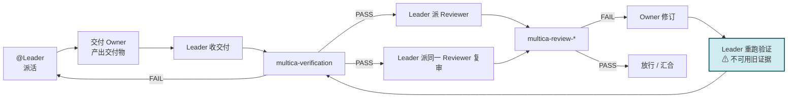
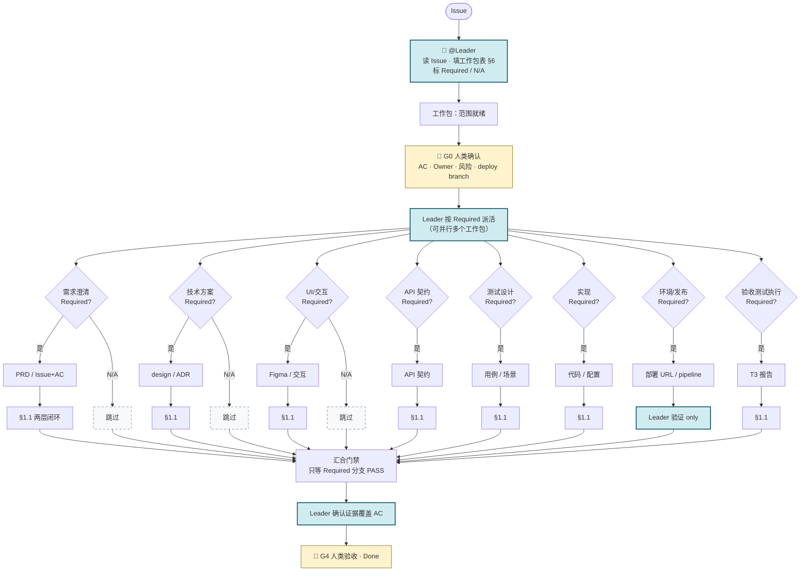
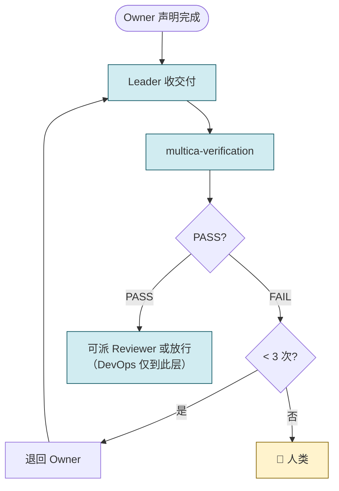
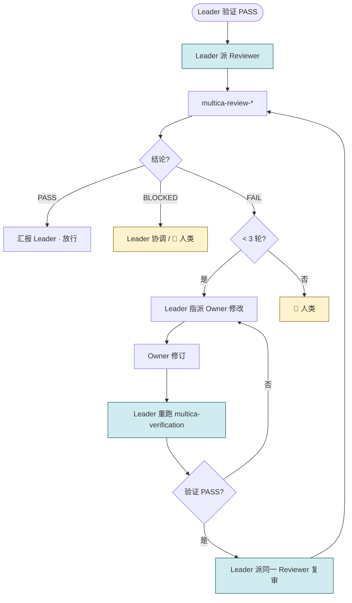
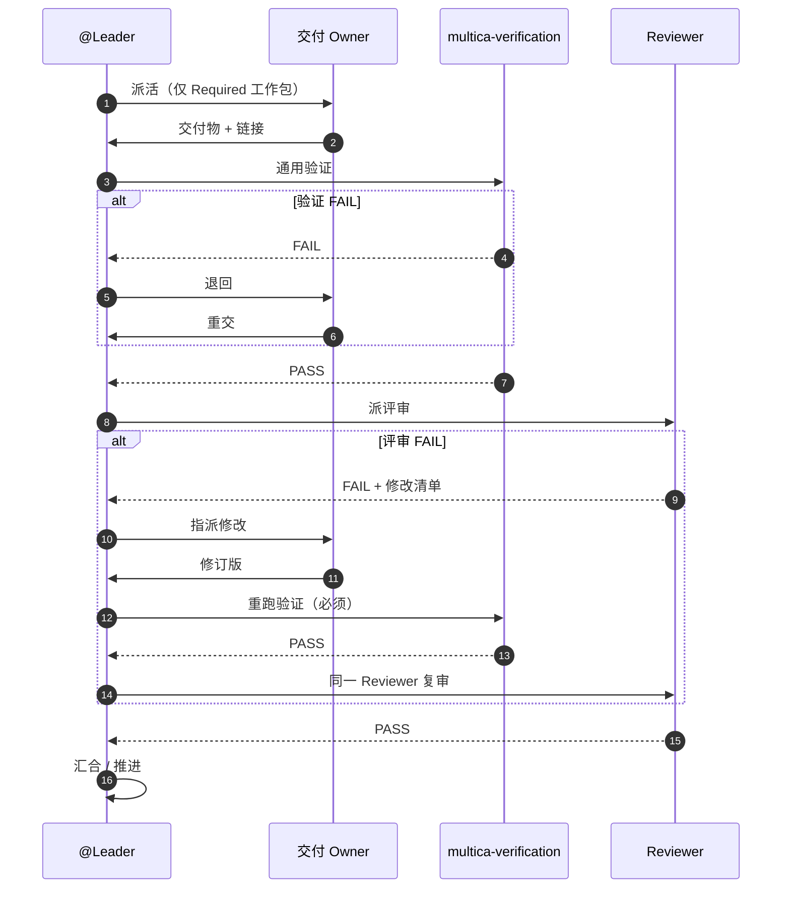
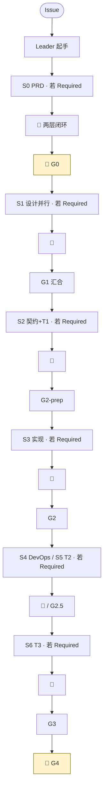

# Software Development (Reviewed) 全流程图

> **演示用** — 主文讲**交付物驱动裁剪**与 **Leader 编排**；[`software-development-reviewed`](../templates/zh_CN/squad/software-development-reviewed/squad.md) 的 S0–S6 / Skill 细节见 **附录 A**。  
> 配套：[`gates-and-evidence.md`](gates-and-evidence.md) · [`cicd-and-test-pipeline.md`](cicd-and-test-pipeline.md) · [`artifact-conventions.md`](artifact-conventions.md)

---

## 0. 读本文前先分清两层


| 层次                       | 回答什么                                                                                          | 本文位置         |
| ------------------------ | --------------------------------------------------------------------------------------------- | ------------ |
| **方法层**                  | 交付物与风险决定**工作包**；治理规则决定评审与人类门禁                                                                 | §1–§8        |
| **Reviewed Starter 配置层** | 已启用的**常规交付物**默认走「通用验证 + 专属 Reviewer」两层；DevOps **例外**（仅 Leader 验证）；G0 / G4 **人类**；失败升级 **3 次** | §0.1、§4、附录 A |


**本次文档重点：** 纠正「所有产出角色必须依次出场」的误解 — **不是**删除 Starter 已配置的质量门禁。

### 0.1 Reviewed Starter 固定配置（相对方法层的默认值）

```text
● 已启用常规交付物 → Leader multica-verification → 专属 multica-review-*（DevOps 无 Reviewer 层）
● G0 / G4 → 人类确认（Agent 不能代签）
● 通用验证 FAIL 与专业评审 FAIL → 独立计数，共用 3 次上限 → 升级人类
● 角色裁剪 ≠ 门禁裁剪：不启用 Designer 可跳过 UI 工作包；已启用 UI 交付物仍须 DesignReviewer
```

---

## 1. 核心模型：交付物驱动，Leader 串联

**流程由交付物决定，不由角色名单决定。**

- 有 UI 变更 → 才需要 UI / 交互设计交付物 → 才派 @Designer  
- 有 API / 数据契约变更 → 才需要契约设计 → 才派 @BackendDev（契约阶段）  
- 需要**新的**部署链路或环境 → 才需要 DevOps 工作包  
- T3 硬前置是 **「可访问的验证环境证据」（G2.5）**，不是「DevOps 角色必须出场」— 已有 URL 则看证据，不看角色是否在名单里

**@Leader**（Squad 注入）：读 Issue → **填工作包表（§6）** → 只派 **Required** 工作包 → 收交付 → 验证 → 派 Reviewer → 汇合门禁 → 升级。**产出角色不互相派活。**

### 1.1 单交付物闭环（每个 Required 工作包重复）




> **关键修正：** Reviewer 驳回后，交付物已变 → **必须先重跑通用验证**，再进入同一 Reviewer 复审；不得用修改前的验证证据背书。

### 1.2 动态主流程（仅 Required 工作包入场）




**汇合规则：** 门禁只等 **Required** 交付物两层 PASS；**N/A** 分支不得把流程永久卡住。

---

## 2. 底线 vs 可选项


| 类型       | 内容                                  | 说明                             |
| -------- | ----------------------------------- | ------------------------------ |
| **必须**   | 范围与验收标准                             | 做什么、不做什么、如何判定完成                |
| **必须**   | 明确交付 Owner                          | 每个工作包唯一负责人                     |
| **必须**   | 基于证据的验证                             | 不能只听「已完成」                      |
| **必须**   | 失败返工或升级路径                           | 阈值由规则设定（Starter：**3 次**）       |
| **按需**   | PRD、技术设计、UI、API 契约                  | 能降低不确定性或满足治理时才创建               |
| **按需**   | PM、Architect、Designer、Tester、DevOps | **角色是能力承接方，不是流程节点**            |
| **按工作包** | 独立 Reviewer                         | 方法层看风险；Starter：**已启用常规交付物默认要** |
| **按治理**  | 人类签字                                | Starter 固定 **G0 / G4**         |


---

## 3. 角色何时启用


| 角色 / 能力            | 何时启用                      | 可不启用                 |
| ------------------ | ------------------------- | -------------------- |
| **Leader**         | Reviewed Starter 所有 Issue | Starter 配置不跳过        |
| **ProductManager** | 需求边界不清、需正式 PRD、多方统一 AC    | Issue 已有完整范围与 AC     |
| **Architect**      | 跨系统、NFR、长期架构、难回滚决策        | 局部可逆、沿用现有架构          |
| **Designer**       | 新界面、关键交互、设计系统变更           | 无 UI 变更              |
| **FrontendDev**    | 范围含前端实现                   | 无前端改动                |
| **BackendDev**     | 范围含服务端 / 数据 / API         | 无后端改动                |
| **Tester**         | 需独立测试设计、回归、自动化执行          | 低风险且治理允许产出者自测 + 门禁验证 |
| **DevOps**         | CI/CD、环境、发布策略需变更          | 现有部署链路可复用且本次不改发布     |
| **Reviewer**       | 工作包规则要求独立审查               | 工作包未启用或治理仅要通用门禁      |


**三条规则：**

1. **先问缺什么交付物，再问谁来做。**
2. 可一人承担多能力，**不能伪造独立性** — Reviewer 不得与产出者同一执行主体。
3. **角色未启用 ≠ 证据自动缺失** — 无 DevOps 也可能已有部署 URL；Leader 看前置证据。

---

## 4. 两层门禁与子循环（Reviewed Starter）


| 层         | 执行者                              | 问什么            | FAIL 后                                      |
| --------- | -------------------------------- | -------------- | ------------------------------------------- |
| **第 1 层** | @Leader · `multica-verification` | 对不对？证据齐？AC 对照？ | 退回 Owner → **重验证**（≤3）                      |
| **第 2 层** | 专属 Reviewer · `multica-review-*` | 专不专业？风险够吗？     | Owner 修订 → **重验证** → **同一 Reviewer 复审**（≤3） |


**BLOCKED ≠ FAIL：** 缺上游、权限、环境 → BLOCKED，**不消耗**质量返工次数。

### 4.1 Leader 验证子循环




### 4.2 Reviewer 评审子循环（含修订后重验证）




### 4.3 时序图




---

## 5. 门禁：等「需要的证据」，不等「所有角色」


| 门禁          | 何时存在                 | 放行条件                     | 可跳过 / 轻量化             |
| ----------- | -------------------- | ------------------------ | --------------------- |
| **G0 范围**   | 所有任务                 | 范围、AC、Owner、工作包表明确       | 不可跳过；可很轻量             |
| **G1 方案**   | 需要 PRD / 技术 / UI 交付物 | **Required** 方案证据两层 PASS | 无新方案的工作包标 N/A         |
| **G2 实现**   | 有实现变更                | 受影响实现 + 必要用例 Ready       | 纯文档任务无实现              |
| **G2.5 环境** | 需部署后验证               | **可访问环境 + 版本标识**         | 不需要部署验证则 N/A          |
| **G3 验收证据** | 需要测试 / 运行证据          | Required 证据类型齐备          | 跳过不适用的证据类型，不跳过完成判定    |
| **G4 决策**   | 需业务验收 / 发布           | 👤 有权决策者                 | Starter 默认不可 Agent 代签 |


---

## 6. 工作包表（Issue 开始时 Leader 填写）

不必每个 Issue 都跑满 S0–S6；小任务可以只有「范围 → 实现 → 验证 → 交付」。


| 工作包     | 是否需要    | 交付物             | Owner（能力/角色）   | 验证证据       | 独立评审（Starter）   | 前置            |
| ------- | ------- | --------------- | -------------- | ---------- | --------------- | ------------- |
| 需求澄清    | 是/否/N/A | PRD 或完整 Issue   | PM 或 Leader 收敛 | AC 对照      | ProductReviewer | —             |
| 技术方案    | 是/否/N/A | design.md / ADR | Architect      | 约束与可行性     | ArchReviewer    | 需求可读          |
| UI / 交互 | 是/否/N/A | Figma / 规则      | Designer       | 状态、响应式     | DesignReviewer  | 需求可读          |
| API 契约  | 是/否/N/A | openapi + 契约 md | BackendDev     | 契约自检       | BackendReviewer | 需求/方案         |
| 测试设计    | 是/否/N/A | 用例 JSON / 场景    | Tester         | AC 覆盖      | TestReviewer    | 范围可读          |
| 实现      | 是/否/N/A | 代码 / 配置         | FE / BE        | 构建、测试、diff | FE/BE Reviewer  | 必要方案 Ready    |
| 环境与发布   | 是/否/N/A | URL / pipeline  | DevOps         | 部署日志       | **仅 Leader 验证** | 实现可部署         |
| 验收测试执行  | 是/否/N/A | T3 报告           | Tester         | AC 报告      | TestReviewer    | **G2.5 环境证据** |


---

## 7. 三种典型裁剪

### 7.1 轻量：局部、低风险

```text
Issue 已有 AC → Owner 改代码 → 自测 + Leader 验证 → （Starter）Reviewer → 交付
```

不必为「流程完整」强行加 PM、Architect、Designer、Tester、DevOps。

### 7.2 标准：普通产品功能

```text
G0 → 按需 UI/API 方案 → 并行实现 → 集成验证 → 有 URL 则 T3 → G4
```

只启用与实际交付物对应的角色。

### 7.3 强治理：高风险 / 受控发布

```text
👤 G0 → 正式方案 → 两层评审 → 实现与测试 → G2.5 证据 → 👤 G4
```

环节多是因为**风险高**，不是因为角色名单长。

---

## 8. Leader 检查清单

**开始前**

- [ ] 范围、不做项、AC 清楚？  
- [ ] 本次 **Required** 交付物有哪些？哪些 **N/A**？  
- [ ] 每工作包 Owner、前置条件明确？  
- [ ] 哪些靠自动证据？哪些要 Reviewer / 人类？  

**执行中**

- [ ] 只派 **Required** 工作包，不为空角色造空任务  
- [ ] 交付物修改后 **重跑受影响验证**  
- [ ] 汇合只等 Required 分支  
- [ ] 缺信息 / 权限 / 环境 → **BLOCKED**，不伪装成 FAIL  

**结束前**

- [ ] 证据覆盖本次实际 AC？  
- [ ] N/A 有理由？  
- [ ] 发布 / 安全 / 业务决策已交 👤 G4？  

---

## 9. 演示话术（30 秒）

1. **不是全员流水线** — 先填工作包表，Required 才派活。
2. **Leader 串联** — 派活、验证、派 Reviewer、汇合；产出者不互相指挥。
3. **Reviewer 驳回后先重验证** — 再复审；BLOCKED 不算 FAIL 次数。
4. **G2.5 看环境证据** — 不只看 DevOps 是否在名单里。
5. **Starter 默认两层门禁** — 已启用交付物不能省 Reviewer；DevOps 例外。

---

## 附录 A. Reviewed Starter 全量参考路径（非默认必经）

> 完整产品功能、**所有工作包均 Required** 时的「满配」编排；与 [`squad.md`](../templates/zh_CN/squad/software-development-reviewed/squad.md) S0–S6 标签对应。**多数 Issue 应裁剪 §6 表，而非默认跑满本附录。**




🔄 = §4 两层子循环（含修订后重验证）。

---

## 附录 B. 角色 · Skill · Reviewer 映射


| 参考阶段   | 产出角色            | Skills（按序）                                                         | Reviewer         | 评审 Skill                   |
| ------ | --------------- | ------------------------------------------------------------------ | ---------------- | -------------------------- |
| 需求     | @ProductManager | `multica-requirement-analysis` → `multica-artifact-req-sync`      | ProductReviewer  | `multica-review-product`   |
| 技术设计   | @Architect      | `multica-technical-design` → `multica-artifact-design-sync`          | ArchReviewer     | `multica-review-architect` |
| UI     | @Designer       | `multica-artifact-ui-sync`                                         | DesignReviewer   | `multica-review-designer`  |
| API 契约 | @BackendDev     | `multica-artifact-api-sync`                                         | BackendReviewer  | `multica-review-backend`   |
| T1 用例  | @Tester         | `multica-test-orchestration` → `multica-test-t1-design`            | TestReviewer     | `multica-review-test`      |
| 前端实现   | @FrontendDev    | `multica-frontend-impl` → `multica-artifact-frontend`              | FrontendReviewer | `multica-review-frontend`  |
| 后端实现   | @BackendDev     | `multica-backend-impl` → `multica-artifact-api-sync`                | BackendReviewer  | `multica-review-backend`   |
| DevOps | @DevOps         | `multica-platform-jenkins` → `multica-artifact-cicd-sync`          | **无**            | —                          |
| T2     | @Tester         | `multica-test-t2-coverage`                                         | TestReviewer     | `multica-review-test`      |
| T3     | @Tester         | `multica-test-t3-ui-automation` + `multica-test-t3-api-automation` | TestReviewer     | `multica-review-test`      |


PM Review FAIL → Workflow B 更新（不重复建 Story），同样遵循 §4.2「修订 → 重验证 → 复审」。

---

## 附录 C. 分支 · 产物 · 命令

**Deploy branch（G0）：** `release/<ISSUE-KEY>-<slug>`；feature 分支 merge 后进 G2；DevOps 只打 deploy branch。

**汇合（满配参考）：** G2-prep = 契约 + T1；G2 = 实现；G3 = T2 + T3（T3 需 G2.5 环境证据）。

**T1 导入：** 用例正文维护在团队平台（默认 Confluence）；**人工口令** 后才导出 / 导入到测试管理平台，且每批只导入一次。

**验证 Skill：** [`multica-verification`](../templates/zh_CN/skills/multica-verification/SKILL.md) · **评审 Skill：** `templates/zh_CN/skills/multica-review-*/`

---

## 附录 D. 延伸阅读


| 文档                                                                                                    | 内容                    |
| ----------------------------------------------------------------------------------------------------- | --------------------- |
| `[software-development-reviewed/squad.md](../templates/zh_CN/squad/software-development-reviewed/squad.md)` | Squad Instructions 原文 |
| `[gates-and-evidence.md](gates-and-evidence.md)`                                                      | 门禁与证据                 |
| `[cicd-and-test-pipeline.md](cicd-and-test-pipeline.md)`                                              | G2 / G2.5 / T1–T3     |
| `[role-skills-architecture.md](role-skills-architecture.md)`                                          | Skill 四层架构            |
| `[templates/zh_CN/skills/README.md](../templates/zh_CN/skills/README.md)`                                         | Skill 索引              |


