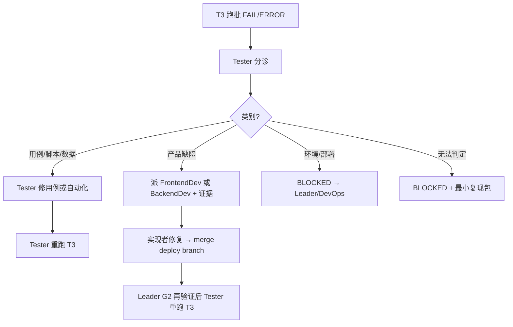

# T3 自动化失败 · 分诊（Triage）

**责任 Agent**：**@Tester**（验收标准验证者）。  
实现者（FrontendDev / BackendDev）**不**自行改测试用例来「刷绿」，除非 Tester 分诊结论为「用例错误」且已书面派活。

---

## 流程（FAIL 或 ERROR 时）



---

## 分诊类别

| 类别 | 典型信号 | 负责 | 下一步 |
| --- | --- | --- | --- |
| **T-用例** | 步骤与 PRD/AC 不符；locator 过期但 UI 正确；Apifox 断言过脆；测试数据脏 | **Tester** | 修订 T1/自动化 → 重跑；重大修订走 `multica-review-test` |
| **T-产品** | 复现步骤符合 AC，实际与期望不符；接口 5xx/错误码与契约不符 | **FrontendDev / BackendDev**（Tester 派活） | 开缺陷描述 + AC + 日志；实现者修代码 **不得删测试降标** |
| **T-环境** | deploy_url 不可达；G2.5 未 PASS；Apifox 环境变量错 | **Leader / DevOps** | BLOCKED；补评论后再跑 |
| **T-阻塞** | 无法稳定复现；缺权限/账号 | **Leader + 人类** | BLOCKED；列最小复现所需 |

---

## Tester 分诊输出（必填）

```markdown
## T3 分诊 — {JIRA_KEY}

| 项 | 值 |
| --- | --- |
| 失败用例/CASE-ID | |
| 分诊结论 | T-用例 / T-产品 / T-环境 / T-阻塞 |
| 依据 | 日志摘录 + AC- 对照 |
| 下一步负责人 | @Tester / @FrontendDev / @BackendDev / @Leader |
| 是否重跑 T3 | 待修复后 / 立即重跑 |
```

- **T-产品**：须 @ 具体角色并附 **AC-、期望、实际、截图/日志**  
- **禁止**：Backend 未分诊就改 pytest/Apifox 断言；Tester 未分诊就判产品 FAIL 并关闭 Issue

---

## 与 G3 的关系

- 分诊完成前，整单结论保持 **FAIL** 或 **BLOCKED**（非 PASS）  
- 仅 Tester 在重跑通过后可将对应 AC 改为 PASS  
- Leader G3 以 Tester 合并报告为准
